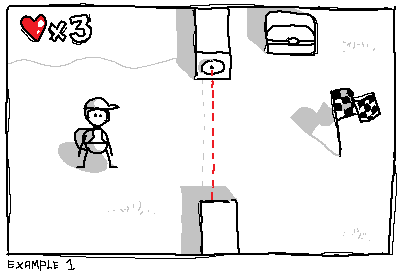
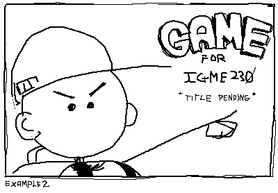

# Project 1 Proposal

## 1. Game Concept

This game, title pending, is a puzzle/adventure game in which the player traverses small worlds unlocking treasures to progress to the next level. 

## 2. Genre

This game most likely fits into the puzzle genre, akin to mobile apps or webgames that have simple and addictive gameplay and that are easy to learn. "For all ages," I suppose, but strategy and technical skill are involved. 

## 3. Platform

Preferably desktop only, perhaps mobile friendly but I'm planning on using keycodes - that may be an issue with mobile users interacting with their keyboard on a webpage.

## 4. Story

This game dosen't have much of a story, other than the main character is on a quest to traverse these lands for whatever reason and progress whilst collecting riches. 

## 5. Aesthetics

Simple, cartoonish, perhaps using vector art. The music would be produced by me, and will most likely be jolly or ambient type tracks and sounds with respect to each area/level.

## 6. Gameplay

The player has the choice of moving in each direction that they'd like, but turn-by-turn enemies and obstacles may move with them. So while they have the overlaying objective in mind, they aslo have to be careful while making their next turn as to not over/undercompensate their moves. The player is gradually brought into the game by being introduced to simple and mindless levels, and as they progress, the challenge becomes more clear and a sense of strategy emerses. 

## 7. Screenshots

## 8. Developer

I'm a second year GDD student, and my name is Joseph P. Aquiare. My skillset includes being pretty proficient at everything it takes to make a game - I use Unity/3DS Max, Photoshop, Illustrator, FL Studio and Ableton Live for music production and sound creation, etc. I feel like I'm well suited to make a game on my own. 